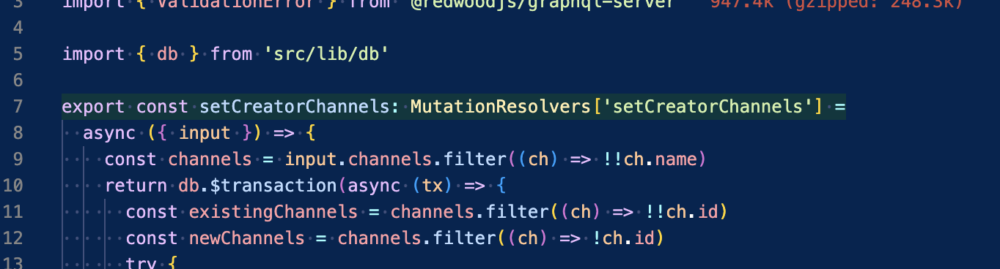

# go-to-unit-test README

## Features

- Show the functions that are covered by unit tests by highlighting the function in the source code with a green background

- Jump to the source code. Have the cursor on the function name and open the command palette and search for "go to unit test", alternatively assign a keybord shortcut to this command

## Requirements

In a ts project, your test files must have the extension .test.ts and be inside the same folder as the implementation or a parent folder.

The test file must contain `describe('nameOfTheFunction')` in order to be recognized as the test for the function
